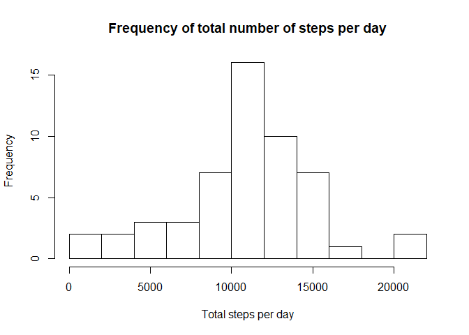
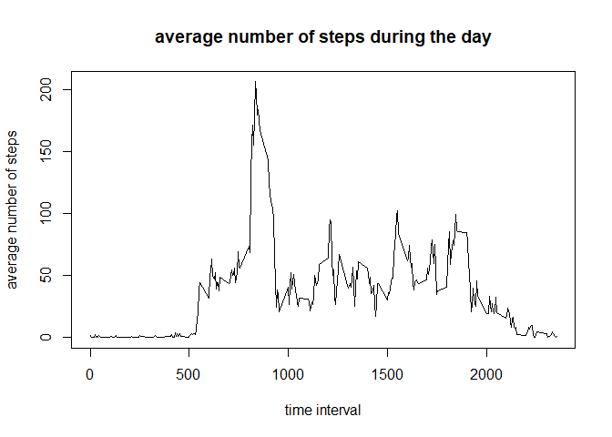
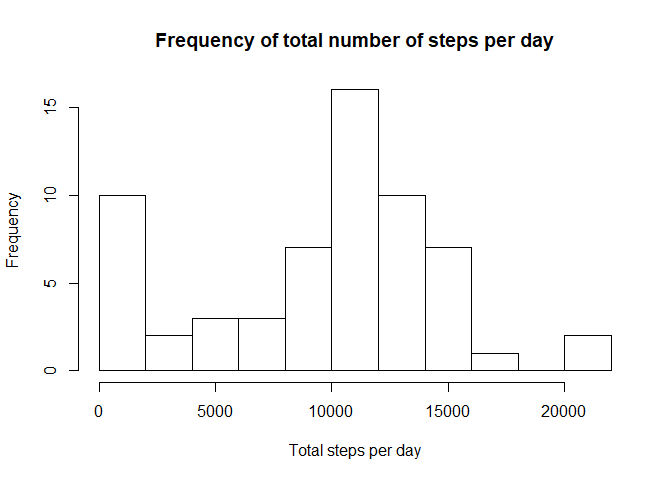
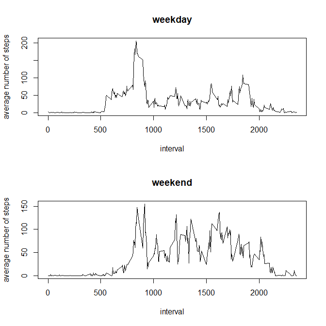

## Loading and preprocessing the data
First, we load the activity data in R. 
We generate a new column in the dataset activity with name datetime out of date and interval.
Also, we generate a second dataset excluding all of the NA-values.


```r
library(dplyr)
library(stringr)
library(lubridate)
unzip(zipfile="activity.zip",exdir="activity")
activity<-read.csv("activity/activity.csv")

activity<-mutate(activity, interval=str_pad(as.character(interval), 4,pad="0"))

activity<-mutate(activity, date=ymd(date))
activity_nna <- filter(activity, !is.na(steps))
```


## What is mean total number of steps taken per day?
We don't want to include NA-values to answer this question. That's why we use the data setr activity_nna.
First, we calculate the total number of steps for each day:


```r
totals_per_date <- aggregate(activity_nna$steps, list(activity_nna$date), sum)
totals_per_date <- rename(totals_per_date, date=Group.1, total.steps=x)
```

Next, we can have a look at the frequencies of the total number of steps taken per day.


```r
hist(totals_per_date$total.steps, breaks=10, xlab="Total steps per day", main="Frequency of total number of steps per day")
```

<!-- -->

We can see, that most of the days, the anonymous individual takes between 10000 and 12000 steps per day.


```r
total_mean <- format(round(mean(totals_per_date$total.steps),2), nsmall=2)
total_median <- median(totals_per_date$total.steps)
```

The mean of the total number of steps per day is 10766.19 (rounded to 2 decimal places)  and the median is 10765.

## What is the average daily activity pattern?

we want to get an impression, how the average daily actvity pattern looks like. It is visualized in the following plot:


```r
avg_activity<-aggregate(activity_nna$steps, list(activity_nna$interval), mean)
avg_activity<-rename(avg_activity, interval=Group.1, average.steps=x)
plot(avg_activity, type="l", ylab="average number of steps", xlab="time interval", main="average number of steps during the day")
```

<!-- -->


```r
max_interval_begin <- filter(avg_activity, avg_activity$average.steps==max(avg_activity$average.steps))$interval
begin_char <- paste(substr(max_interval_begin, 1,2), substr(max_interval_begin, 3,4), sep=":")
max_interval_end <- str_pad(as.character(as.integer(max_interval_begin)+5), 4,pad="0")
end_char <- paste(substr(max_interval_end, 1,2), substr(max_interval_end, 3,4), sep=":")
```

On average, the most steps are taken between 08:35 and 08:40.

## Imputing missing values


```r
count_na<-nrow(filter(activity, is.na(steps)))
count<-nrow(activity)
```

There are 2304 rows with missing step counts. Compared to the total number of rows in the original set (17568) this is quite a lot.  
We are going to impute these missing values. For this, we take the median for each interval and replace the missing values for each interval with that median.


```r
median_per_interval<-aggregate(activity_nna$steps, list(activity_nna$interval), median)
median_per_interval<-rename(median_per_interval, interval=Group.1, median.steps=x)

activity_impute <- merge(activity, median_per_interval, by="interval") %>% mutate(steps= ifelse(is.na(steps), median.steps, steps))
activity_impute <- select(activity_impute, -median.steps) %>% arrange(date,interval)
```

Now we recalculate the total number of steps for each day.


```r
totals_per_date_impute <- aggregate(activity_impute$steps, list(activity_impute$date), sum)
totals_per_date_impute <- rename(totals_per_date_impute, date=Group.1, total.steps=x)
```

Next, we can have again a look at the frequencies of the total number of steps taken per day.


```r
hist(totals_per_date_impute$total.steps, breaks=10, xlab="Total steps per day", main="Frequency of total number of steps per day")
```

<!-- -->

We can see, that most of the days, the anonymous individual takes between 10000 and 12000 steps per day. That is no different than without imputing. But there is an increase in the frequency of days with low activity. This definitely strongly depends on the kind of the imputed values.


```r
total_mean_impute <- format(round(mean(totals_per_date_impute$total.steps),2), nsmall=2)
total_median_impute <- median(totals_per_date_impute$total.steps)
```

The mean of the total number of steps per day is 9503.87 (rounded to 2 decimal places)  and the median is 10395.
After imputing the mean has changed quite strongly, while the median only slightly. That was to be expected, as we have imputed the median.

## Are there differences in activity patterns between weekdays and weekends?

Now, we want to evaluate differences in activities between weekdays and weekends. For this we first determine if the day of date is weekday or weekend. Then we can plot the average steps taken per interval, separate for weekday and weekend.


```r
activity_impute<-mutate(activity_impute, weekday=ifelse(weekdays(date)=="Samstag" | weekdays(date)=="Sonntag", "weekend", "weekday"))
activity_impute<-mutate(activity_impute, weekday=as.factor((weekday)))
act_weekday<-filter(activity_impute, weekday=="weekday")
act_weekend<-filter(activity_impute, weekday=="weekend")
avg_weekday<-aggregate(act_weekday$steps, list(act_weekday$interval), mean) %>% rename(interval=Group.1, average.steps=x)
avg_weekend<-aggregate(act_weekend$steps, list(act_weekend$interval), mean) %>% rename(interval=Group.1, average.steps=x)
par(mfrow=c(2,1))
plot(avg_weekday$interval, avg_weekday$average.steps, type="l", xlab="interval", ylab="average number of steps", main="weekday")
plot(avg_weekend$interval, avg_weekend$average.steps, type="l", xlab="interval", ylab="average number of steps", main="weekend")
```

<!-- -->

We can see a pattern during weekdays. During the weekends there is in general more activity during the day.
